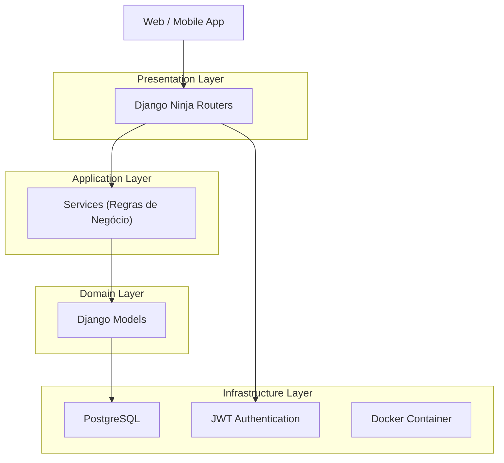
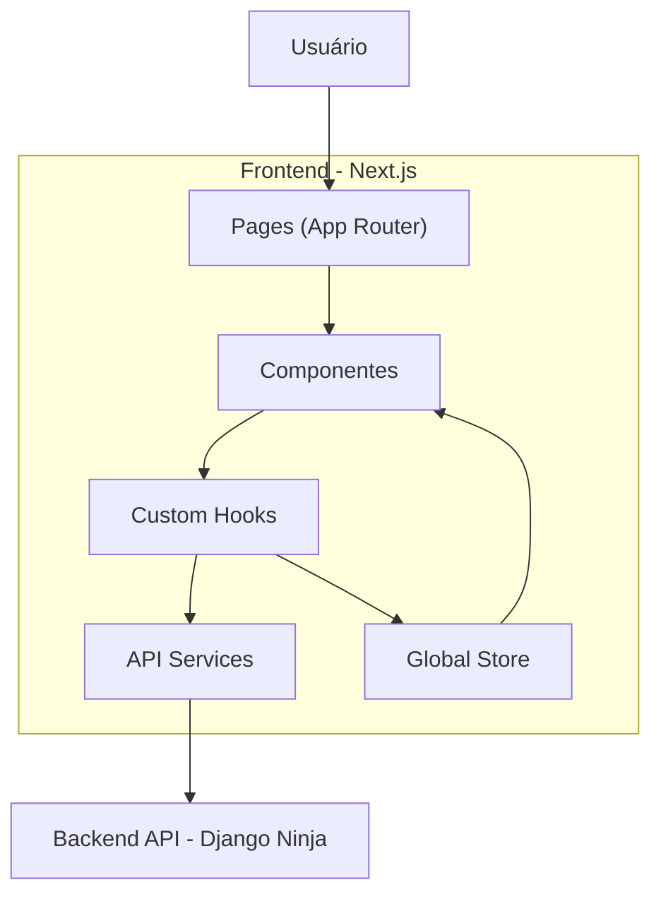

## Arquitetura - ReadRats

### Visão Geral
ReadRats é uma API REST desenvolvida para gerenciar comunidades de leitura, desafios, pontuação e ranking entre usuários.

A aplicação foi projetada com foco em:

- Escalabilidade futura
- Separação de responsabilidades
- Suporte a Web e Mobile (futuro)
- Código organizado e modular

### Tecnologias 

#### Backend
- Python 
- Django
- Django Ninja (API REST)
- PostgreSQL
- JWT 
- Docker

#### Front
- Next.js (React Framework)
- TypeScript
- Axios (ou Fetch API, ainda a decidir)
- JWT (armazenado no client)
- Tailwind
- React context (ou Zustand, ainda a decidir)

---

### Arquitetura Backend

A aplicaçao segue o padrão API REST em camadas, recebendo respostas em formato json e organizada de forma modular por domínio.

#### Padrão arquitetural
1. Presentation Layer: Endpoints REST
2. Application Layer: Services contendo as regras de negócio
3. Domain Layer: Models 
4. Infrastrucure Layer: Banco de dados, autenticação JWT e container docker

#### Estrutura de Pastas (Backend)

```plaintext
readrats/
│
├── core/                 # Configurações globais
│   ├── settings.py
│   └── security.py
│
├── apps/                 # Domínios da aplicação
│   ├── users/
│   ├── comunidades/
│   ├── desafios/
│   ├── posts/
│
├── services/             # Regras de negócio
│   ├── ranking_service.py
│   ├── score_service.py
│
├── api/                  # Camada de apresentação
│   ├── users_router.py
│   ├── comunidades_router.py
│   ├── desafios_router.py
│
├── docker/
│
├── manage.py
```

#### Diagrama de arquitetura (Backend)



#### Planos futuros
- Evoluir para cache (Redis)
- Evoluir para background jobs (Celery)
---

### Arquitetura Front
O frontend do ReadRats será uma aplicação Web construída com Next.js, consumindo a API REST do backend.

#### Padrão arquitetural
Organização por domínio (igual backend). Onde, cada feature tem: 
- Componentes
- Serviços (API)
- Hooks
- Tipos

#### Estrutura de pastas (Frontend)

```plaintext
src/
│
├── app/                      # Rotas (Next.js App Router)
│   ├── login/
│   ├── comunidades/
│   ├── desafios/
│   └── ranking/
│
├── features/                 # Funcionalidades por domínio
│   ├── auth/
│   │   ├── components/       # Componentes específicos
│   │   ├── services/         # Comunicação com API
│   │   ├── hooks/            # Lógica reutilizável
│   │   └── types.ts          # Tipos TypeScript
│   │
│   ├── comunidades/
│   ├── desafios/
│   ├── posts/
│   └── ranking/
│
├── shared/                   # Recursos compartilhados
│   ├── components/           # Componentes reutilizáveis
│   ├── ui/                   # Elementos de interface
│   ├── hooks/                # Hooks globais
│   └── utils/                # Funções utilitárias
│
├── services/                 # Configuração de serviços globais
│   └── api.ts                # Configuração base do Axios
│
├── store/                    # Gerenciamento de estado global
│   └── authStore.ts
│
└── types/                    # Tipos globais
```

#### Diagrama de Arquitetura (Frontend)




