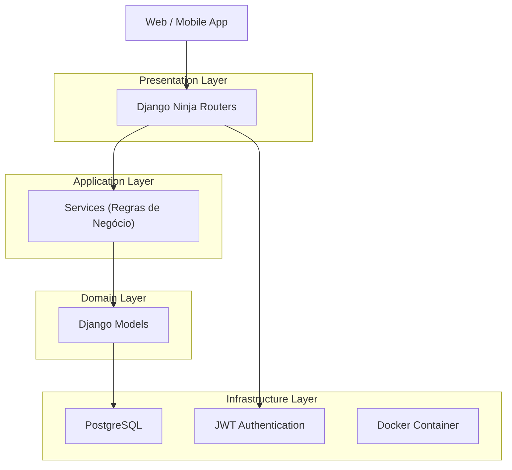

## Arquitetura - ReadRats

### Visão Geral
ReadRats é uma API REST desenvolvida para gerenciar comunidades de leitura, desafios, pontuação e ranking entre usuários.

A aplicação foi projetada com foco em:

- Escalabilidade futura
- Separação de responsabilidades
- Suporte a Web e Mobile
- Código organizado e modular

### Tecnologias 

#### Backend
- Python 
- Django
- Django Ninja (API REST)
- PostgreSQL
- JWT 
- Docker

### Arquitetura Backend

A aplicaçao segue o padrão API REST em camadas, recebendo respostas em formato json e organizada de forma modular por domínio.

#### Padrão arquitetural
1. Presentation Layer: Endpoints REST
2. Application Layer: Services contendo as regras de negócio
3. Domain Layer: Models 
4. Infrastrucure Layer: Banco de dados, autenticação JWT e container docker

#### Estrutura de Pastas

```plaintext
readrats/
│
├── core/                 # Configurações globais
│   ├── settings.py
│   └── security.py
│
├── apps/                 # Domínios da aplicação
│   ├── users/
│   ├── comunidades/
│   ├── desafios/
│   ├── posts/
│
├── services/             # Regras de negócio
│   ├── ranking_service.py
│   ├── score_service.py
│
├── api/                  # Camada de apresentação
│   ├── users_router.py
│   ├── comunidades_router.py
│   ├── desafios_router.py
│
├── docker/
│
├── manage.py
```

#### Arquitetura em Camadas




