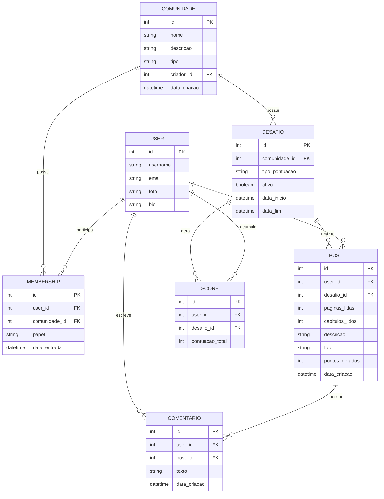

## Dominio - ReadRats

### Visão Geral
Modelagem do dominio do projeto para definição de arquitetura 

### Entidades existentes

- User
- Comunidade
- Desafio
- Post
- Comentário 
- Score
- Membro da comunidade

### Especificando as entidades

#### User
- id
- username
- email
- foto
- bio

Relacionamentos:

- segue outros usuários
- participa de comunidades
- cria posts 
- comenta posts

#### Comunidade
- id 
- nome
- descricao
- tipo (temporaria/continua)
- criador_id
- data_criacao

relacionamentos:
- tem muitos membros
- tem desafios
- tem no minimo 1 desafio ativo 

#### Desafio
- id
- comunidade_id
- tipo_pontuacao
- ativo (boolean)
- data_inicio
- data_fim

relaciomanetos:
- pertence a uma comunidade
- recebe posts
- gera ranking

#### Post
- id
- user_id
- desafio_id
- paginas_lidas
- capitulos_lidos
- descricao
- foto
- pontos_Gerados
- data_criacao

relacionamentos:
- recebe comentários
- realizado por um usuário/membro da comunidade
- gera pontos

#### Comentários
- id 
- user_id
- post_id
- texto
- data_Criacao

relacionamentos:
- realizado em um post
- realizado por um user

### Score
- id
- desafio_id
- user_id
- pontuacao_total

relacionamentos:
- pertence a Desafio
- pertence a USer

#### Membro da comunidade (Entidade associativa)
- id 
- user_id
- papel (admin/membro normal)
- data_entrada

relacionamentos:
- pertence a user
- pertence a comunidade

### Diagrama de dominio

